# T3 Code: deep architectural documentation

A minimal web GUI for coding agents (Codex, Claude). This document covers the full system architecture from build configuration through to the UI layer.

## Table of contents

1. [Monorepo structure and build pipeline](#1-monorepo-structure-and-build-pipeline)
2. [Package dependency graph](#2-package-dependency-graph)
3. [Contracts package: shared schema layer](#3-contracts-package-shared-schema-layer)
4. [Shared package: runtime utilities](#4-shared-package-runtime-utilities)
5. [Server architecture](#5-server-architecture)
6. [Orchestration engine (CQRS/Event Sourcing)](#6-orchestration-engine-cqrsevent-sourcing)
7. [Provider system](#7-provider-system)
8. [Persistence layer](#8-persistence-layer)
9. [WebSocket RPC protocol](#9-websocket-rpc-protocol)
10. [Web application architecture](#10-web-application-architecture)
11. [Desktop application](#11-desktop-application)
12. [Observability](#12-observability)
13. [Data flow: end-to-end message lifecycle](#13-data-flow-end-to-end-message-lifecycle)

---

## 1. Monorepo structure and build pipeline

The project uses Bun workspaces with Turborepo for task orchestration. Four apps and two shared packages live under a single repository.

```
t3code/
├── apps/
│   ├── server/       # Node.js/Bun WebSocket + HTTP server (npm: "t3")
│   ├── web/          # React 19 + Vite 8 SPA
│   ├── desktop/      # Electron 40 shell
│   └── marketing/    # Astro static site
├── packages/
│   ├── contracts/    # Effect Schema definitions (schema-only, no runtime)
│   └── shared/       # Shared runtime utilities (subpath exports)
└── scripts/          # Dev runner, release tooling, desktop artifact builder
```

### Build tools per package

| Package              | Build tool            | Output                                   |
| -------------------- | --------------------- | ---------------------------------------- |
| `apps/server`        | tsdown                | `dist/bin.mjs` (single ESM bundle)       |
| `apps/web`           | Vite 8                | `dist/` (static assets)                  |
| `apps/desktop`       | tsdown                | `dist-electron/` (Electron main process) |
| `apps/marketing`     | Astro                 | Static HTML                              |
| `packages/contracts` | tsdown                | `dist/` (ESM + CJS + DTS)                |
| `packages/shared`    | None (source imports) | Consumed via subpath exports             |

### Turborepo task graph

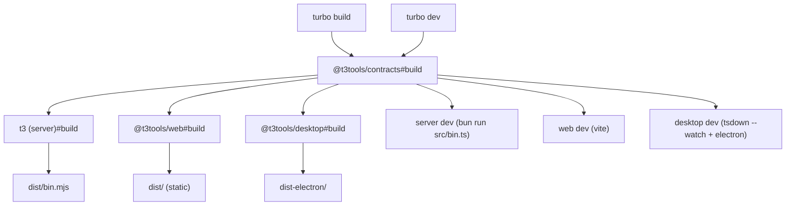

### Key toolchain choices

- **Runtime**: Bun 1.3.9+ or Node.js 24.10+ (dual-runtime support via dynamic imports)
- **TypeScript**: 5.7+ with strict mode, `noUncheckedIndexedAccess`, `exactOptionalPropertyTypes`
- **Linting**: oxlint (Rust-based, plugins: eslint, oxc, react, unicorn, typescript)
- **Formatting**: oxfmt (Rust-based, includes `sortPackageJson`)
- **Testing**: Vitest 4 (unit + integration), Playwright (browser tests for web)
- **Effect-TS**: 4.0.0-beta.43 throughout (managed via Bun catalog)

---

## 2. Package dependency graph

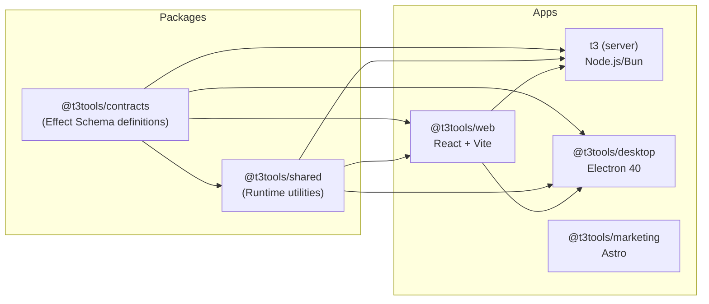

The dependency flow is strictly unidirectional: `contracts` → `shared` → `apps`. The server embeds the web app's built output to serve it as static files in production.

---

## 3. Contracts package: shared schema layer

`packages/contracts` is the single source of truth for all data shapes exchanged between server and client. It contains zero runtime logic; only Effect Schema definitions and TypeScript types.

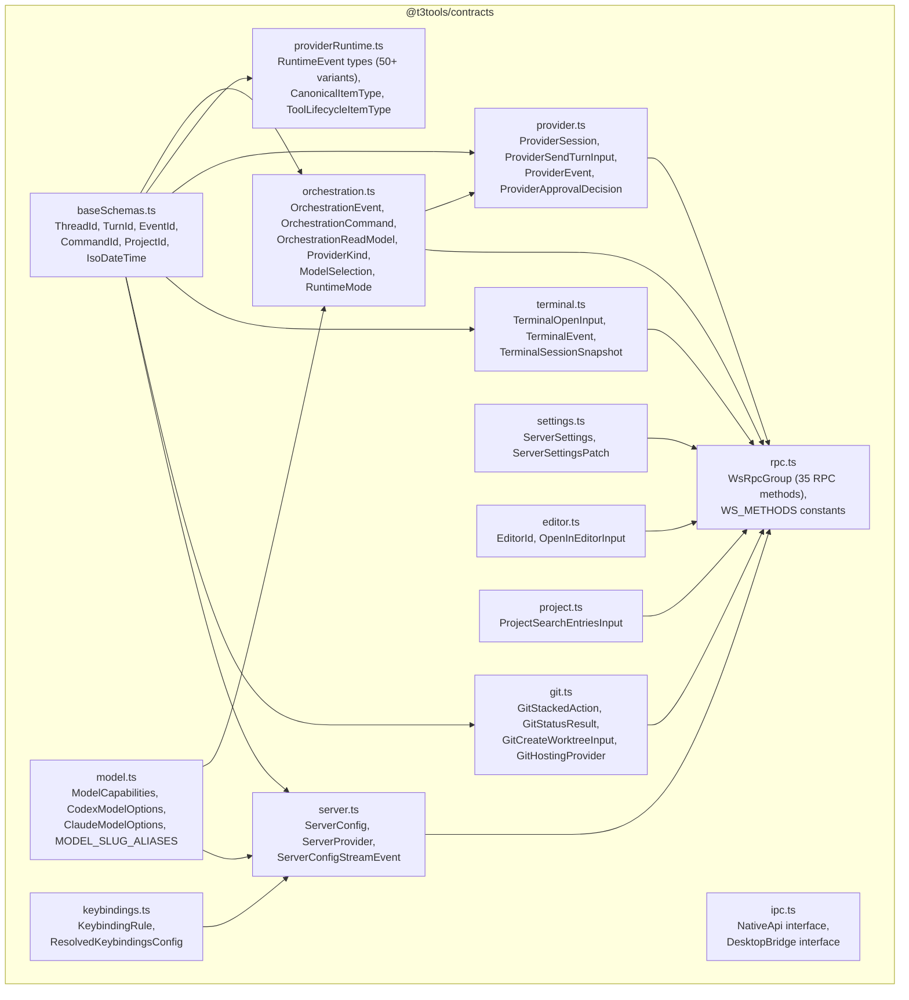

### RPC method categories (35 total)

| Category              | Methods                                                                                                                                                           | Transport            |
| --------------------- | ----------------------------------------------------------------------------------------------------------------------------------------------------------------- | -------------------- |
| Orchestration         | `getSnapshot`, `dispatchCommand`, `getTurnDiff`, `getFullThreadDiff`, `replayEvents`                                                                              | Request/Response     |
| Orchestration streams | `subscribeOrchestrationDomainEvents`                                                                                                                              | Server push (stream) |
| Terminal              | `open`, `write`, `resize`, `clear`, `restart`, `close`                                                                                                            | Request/Response     |
| Terminal streams      | `subscribeTerminalEvents`                                                                                                                                         | Server push (stream) |
| Git                   | `pull`, `refreshStatus`, `listBranches`, `createWorktree`, `removeWorktree`, `createBranch`, `checkout`, `init`, `resolvePullRequest`, `preparePullRequestThread` | Request/Response     |
| Git streams           | `subscribeGitStatus`, `runStackedAction`                                                                                                                          | Server push (stream) |
| Server                | `getConfig`, `refreshProviders`, `upsertKeybinding`, `getSettings`, `updateSettings`                                                                              | Request/Response     |
| Server streams        | `subscribeServerConfig`, `subscribeServerLifecycle`                                                                                                               | Server push (stream) |
| Project               | `searchEntries`, `writeFile`                                                                                                                                      | Request/Response     |
| Shell                 | `openInEditor`                                                                                                                                                    | Request/Response     |

---

## 4. Shared package: runtime utilities

`packages/shared` uses explicit subpath exports (no barrel index). Each export is a focused module consumed by both server and web.

| Subpath export                          | Purpose                                                               |
| --------------------------------------- | --------------------------------------------------------------------- |
| `@t3tools/shared/git`                   | Git status parsing, worktree helpers, status stream event application |
| `@t3tools/shared/logging`               | Structured logging utilities                                          |
| `@t3tools/shared/shell`                 | Shell command execution helpers                                       |
| `@t3tools/shared/Net`                   | Network port utilities (find free port, check availability)           |
| `@t3tools/shared/model`                 | Model slug resolution, alias mapping, provider defaults               |
| `@t3tools/shared/serverSettings`        | Settings file parsing and validation                                  |
| `@t3tools/shared/DrainableWorker`       | Effect-based worker that drains pending items before shutdown         |
| `@t3tools/shared/KeyedCoalescingWorker` | Deduplicates concurrent work by key (coalesces rapid updates)         |
| `@t3tools/shared/schemaJson`            | JSON encode/decode with Effect Schema validation                      |
| `@t3tools/shared/Struct`                | Struct manipulation utilities                                         |
| `@t3tools/shared/String`                | String utilities                                                      |
| `@t3tools/shared/projectScripts`        | Project script detection and parsing                                  |

---

## 5. Server architecture

The server (`apps/server`) is the system's backbone. It runs as a single Node.js/Bun process exposing HTTP + WebSocket endpoints, managing provider sessions, persisting state to SQLite, and orchestrating the full agent lifecycle.

### Server startup sequence

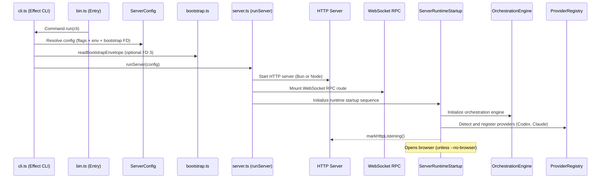

### Server layer composition

The server uses Effect's Layer system for dependency injection. All services are composed at startup into a single runtime layer.

````mermaid
graph TB
    subgraph "Infrastructure Layers"
        SQLITE["SqlitePersistenceLayer<br/>(SQLite + migrations)"]
        PTY["PtyAdapterLive<br/>(BunPTY or NodePTY)"]
        HTTP_SRV["HttpServerLive<br/>(BunHttpServer or NodeHttpServer)"]
        PLATFORM["PlatformServicesLive<br/>(Bun or Node services)"]
        FETCH["FetchHttpClient"]
    end

    subgraph "Domain Service Layers"
        ORCH_ENGINE["OrchestrationEngineLive"]
        ORCH_PIPELINE["OrchestrationProjectionPipelineLive"]
        ORCH_REACTOR["OrchestrationReactorLive"]
        PROV_CMD["ProviderCommandReactorLive"]
        PROV_INGEST["ProviderRuntimeIngestionLive"]
        CHKPT_REACTOR["CheckpointReactorLive"]
        RECEIPT_BUS["RuntimeReceiptBusLive"]
        PROV_SVC["ProviderServiceLive"]
        PROV_REG["ProviderRegistryLive"]
        CODEX["CodexAdapterLive"]
        CLAUDE["ClaudeAdapterLive"]
        ADAPTER_REG["ProviderAdapterRegistryLive"]
        GIT_CORE["GitCoreLive"]
        GIT_MGR["GitManagerLive"]
        GIT_STATUS["GitStatusBroadcasterLive"]
        GIT_HUB["GitHubCliLive"]
        TEXT_GEN["RoutingTextGenerationLive"]
        TERM_MGR["TerminalManagerLive"]
        KEYBIND["KeybindingsLive"]
        SETTINGS["ServerSettingsLive"]
        OPEN["OpenLive"]
        ANALYTICS["AnalyticsServiceLive"]
        OBSERV["ObservabilityLive"]
    end

    subgraph "Persistence Layers"
        EVT_STORE["OrchestrationEventStoreLive"]
        CMD_RECEIPT["OrchestrationCommandReceiptRepositoryLive"]
        PROJ_SNAP["OrchestrationProjectionSnapshotQueryLive"]
        CHKPT_STORE["CheckpointStoreLive"]
        CHKPT_DIFF["CheckpointDiffQueryLive"]
        PROV_SESS_RT["ProviderSessionRuntimeRepositoryLive"]
        PROV_SESS_DIR["ProviderSessionDirectoryLive"]
        EVT_LOG["EventNdjsonLogger"]
    end

    subgraph "HTTP/WS Layers"
        WS_RPC["websocketRpcRouteLayer"]
        STATIC["staticAndDevRouteLayer"]
        ATTACH["attachmentsRouteLayer"]
        OTLP["otlpTracesProxyRouteLayer"]
        FAVICON["projectFaviconRouteLayer"]
    end

    SQLITE --> EVT_STORE
    SQLITE --> CMD_RECEIPT
    SQLITE --> PROJ_SNAP
    SQLITE --> CHKPT_STORE
    SQLITE --> PROV_SESS_RT

    EVT_STORE --> ORCH_ENGINE
    CMD_RECEIPT --> ORCH_ENGINE
    ORCH_ENGINE --> ORCH_PIPELINE
    ORCH_ENGINE --> ORCH_REACTOR
    ORCH_ENGINE --> PROV_CMD
    RECEIPT_BUS --> PROV_INGEST
    PROV_INGEST --> ORCH_ENGINE

    CODEX --> ADAPTER_REG
    CLAUDE --> ADAPTER_REG
    ADAPTER_REG --> PROV_SVC
    PROV_SVC --> PROV_REG

    PTY --> TERM_MGR
    GIT_CORE --> GIT_MGR
    GIT_HUB --> GIT_MGR
    TEXT_GEN --> GIT_MGR

---

## 6. Orchestration engine (CQRS/Event Sourcing)

The orchestration engine is the core domain model. It implements a CQRS/Event Sourcing pattern where all state changes flow through commands that produce events, which are then projected into read models.

```mermaid
graph LR
    subgraph "Command Side (Write)"
        CMD["OrchestrationCommand<br/>(from client or server)"]
        NORM["Normalizer<br/>(canonicalize model slugs,<br/>validate input)"]
        INV["commandInvariants<br/>(pre-condition checks)"]
        DEC["Decider<br/>(command → events)"]
        STORE["OrchestrationEventStore<br/>(SQLite append-only log)"]
    end

    subgraph "Event Side (Read)"
        PROJ["Projector<br/>(events → read model deltas)"]
        PIPELINE["ProjectionPipeline<br/>(applies projections to SQLite)"]
        SNAP["ProjectionSnapshotQuery<br/>(materialized read model)"]
        BROADCAST["WebSocket push<br/>(domain events to clients)"]
    end

    subgraph "Reactors (Side Effects)"
        ORCH_REACT["OrchestrationReactor<br/>(lifecycle side effects)"]
        PROV_CMD_REACT["ProviderCommandReactor<br/>(start/stop/send to providers)"]
        CHKPT_REACT["CheckpointReactor<br/>(git checkpoint creation)"]
    end

    CMD --> NORM --> INV --> DEC
    DEC --> STORE
    STORE --> PIPELINE
    PIPELINE --> PROJ
    PROJ --> SNAP
    STORE --> BROADCAST
    STORE --> ORCH_REACT
    STORE --> PROV_CMD_REACT
    STORE --> CHKPT_REACT
````

### Command types (client-dispatched)

Commands flow from the web client through `orchestration.dispatchCommand`:

- `thread.create` / `thread.archive` / `thread.unarchive` / `thread.rename`
- `thread.sendTurn` / `thread.interruptTurn`
- `thread.respondToApproval` / `thread.respondToUserInput`
- `thread.startSession` / `thread.stopSession`
- `thread.activity.append` (server-generated activities)
- `project.create` / `project.remove` / `project.rename`

### Event flow through the projection pipeline

```mermaid
sequenceDiagram
    participant Client as Web Client
    participant WS as WebSocket RPC
    participant Engine as OrchestrationEngine
    participant Decider as Decider
    participant Store as EventStore (SQLite)
    participant Pipeline as ProjectionPipeline
    participant Projector as Projector
    participant Reactors as Reactors
    participant Broadcast as WS Broadcast

    Client->>WS: dispatchCommand(thread.sendTurn)
    WS->>Engine: dispatch(command)
    Engine->>Decider: decide(command, currentState)
    Decider-->>Engine: OrchestrationEvent[]
    Engine->>Store: append(events)
    Store-->>Pipeline: new events available
    Pipeline->>Projector: project(events)
    Note over Projector: Updates SQLite projection tables:<br/>threads, sessions, messages,<br/>turns, checkpoints, activities
    Store-->>Reactors: react to events
    Note over Reactors: ProviderCommandReactor starts<br/>provider session, sends turn
    Store-->>Broadcast: push events to subscribed clients
    Broadcast-->>Client: orchestration.domainEvent
```

### Decider: pure command-to-event logic

The decider (`orchestration/decider.ts`) is a pure function that takes a command and the current aggregate state, returning zero or more events. It enforces business rules:

- Thread must exist before sending a turn
- Session must be in a valid state for the requested operation
- Model selection is normalized through alias resolution
- Approval responses must reference valid pending requests

### Projector: event-to-read-model materialization

The projector (`orchestration/projector.ts`) transforms events into SQLite projection table updates. Projection tables include:

| Table                              | Purpose                                                     |
| ---------------------------------- | ----------------------------------------------------------- |
| `projection_projects`              | Project metadata (name, cwd, scripts)                       |
| `projection_threads`               | Thread state (title, status, model selection, runtime mode) |
| `projection_thread_sessions`       | Provider session state per thread                           |
| `projection_thread_messages`       | Chat messages (user + assistant)                            |
| `projection_turns`                 | Turn lifecycle (started, completed, failed)                 |
| `projection_checkpoints`           | Git checkpoint references per turn                          |
| `projection_pending_approvals`     | Outstanding approval requests                               |
| `projection_thread_activities`     | Work log entries (tool calls, file changes)                 |
| `projection_thread_proposed_plans` | AI-proposed execution plans                                 |

---

## 7. Provider system

The provider system abstracts coding agent backends behind a unified adapter interface. Two providers are supported: Codex (via `codex app-server` JSON-RPC over stdio) and Claude (via `@anthropic-ai/claude-agent-sdk`).

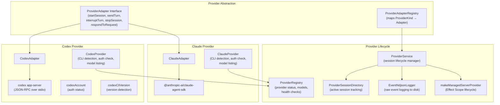

### Codex integration detail

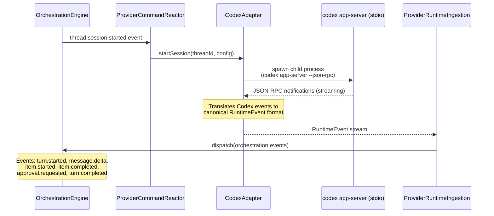

### Provider runtime event ingestion

The `ProviderRuntimeIngestion` layer bridges provider-specific events into the orchestration domain. It receives raw `RuntimeEvent` objects from adapters and translates them into `OrchestrationCommand` dispatches:

- `runtime.session.ready` → marks session as connected
- `runtime.content.delta` → streams text to the client
- `runtime.item.started/completed` → tracks tool executions
- `runtime.approval.requested` → creates pending approval
- `runtime.turn.completed` → finalizes the turn
- `runtime.session.error` → handles provider failures

The `RuntimeReceiptBus` provides backpressure-aware delivery of runtime receipts from providers to the ingestion pipeline.

---

## 8. Persistence layer

All server state is persisted to a single SQLite database with a migration system.

```mermaid
graph TD
    subgraph "SQLite Database (state.sqlite)"
        EVT_TBL["orchestration_events<br/>(append-only event log)"]
        CMD_TBL["orchestration_command_receipts<br/>(idempotency tracking)"]
        PROJ_TBL["projection_projects"]
        THR_TBL["projection_threads"]
        SESS_TBL["projection_thread_sessions"]
        MSG_TBL["projection_thread_messages"]
        TURN_TBL["projection_turns"]
        CHKPT_TBL["projection_checkpoints +<br/>checkpoint_diff_blobs"]
        APPR_TBL["projection_pending_approvals"]
        ACT_TBL["projection_thread_activities"]
        PLAN_TBL["projection_thread_proposed_plans"]
        PROV_RT["provider_session_runtime<br/>(resume cursors)"]
        PROJ_STATE["projection_state<br/>(last processed sequence)"]
    end

    subgraph "Migration System"
        MIG["persistence/Migrations/<br/>001 through 019"]
    end

    MIG --> EVT_TBL
    MIG --> CMD_TBL
    MIG --> PROJ_TBL
```

### Database access pattern

- **Event store**: Append-only writes. Events are never mutated or deleted.
- **Command receipts**: Idempotency guard; prevents duplicate command processing.
- **Projection tables**: Derived from events. Can be rebuilt by replaying the event log.
- **Projection state**: Tracks the last event sequence number processed by the projector.
- **Provider session runtime**: Stores resume cursors for provider session reconnection.

The server supports both Bun's native SQLite (`@effect/sql-sqlite-bun`) and Node.js's built-in `node:sqlite` via `NodeSqliteClient.ts`, selected at runtime.

---

## 9. WebSocket RPC protocol

Client-server communication uses Effect RPC over WebSocket. The protocol supports both request/response and server-push streaming patterns.

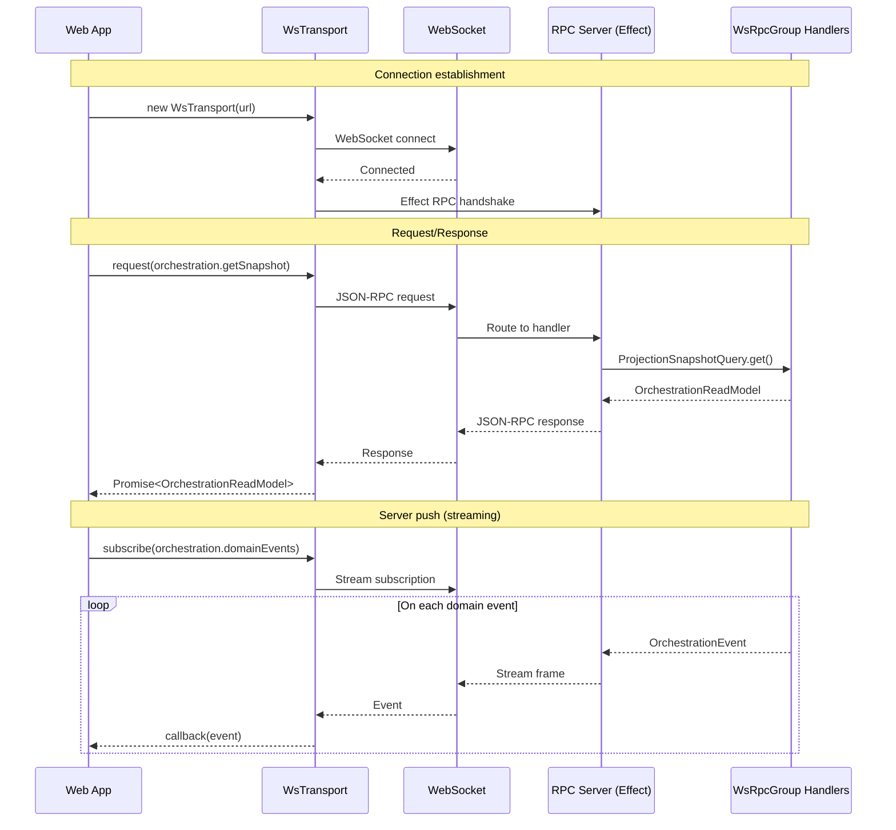

### Client-side RPC architecture

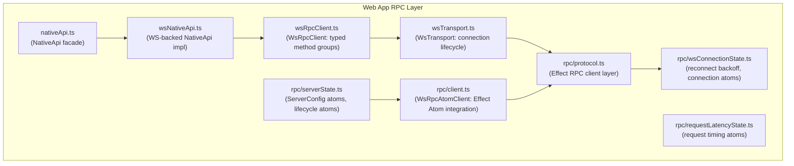

The web app has two RPC consumption paths:

1. **Imperative** (`WsRpcClient`): Promise-based API used by hooks and event handlers
2. **Reactive** (`WsRpcAtomClient`): Effect Atom-based subscriptions that auto-reconnect and push state updates to React components via `@effect/atom-react`

---

## 10. Web application architecture

The web app (`apps/web`) is a React 19 SPA built with Vite 8, using TanStack Router for file-based routing and a layered state management approach.

### Route structure

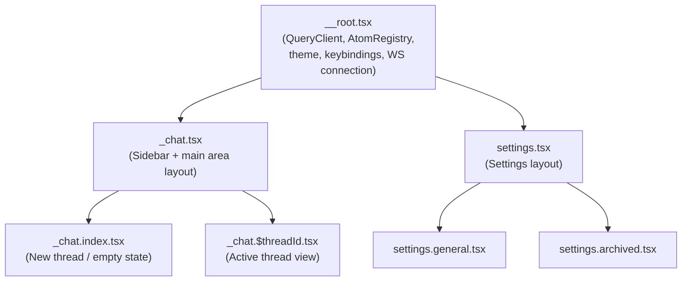

### State management layers

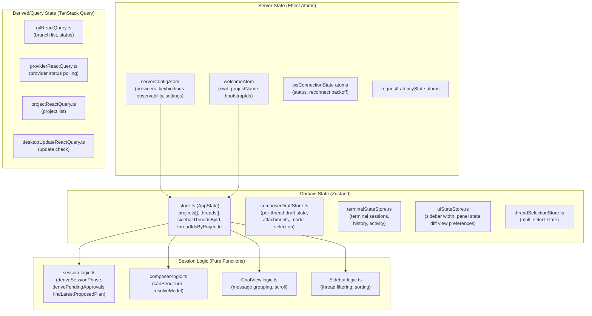

### Component hierarchy

```mermaid
graph TD
    ROOT_COMP["__root.tsx<br/>(providers, global listeners)"]
    APP_LAYOUT["AppSidebarLayout.tsx"]
    SIDEBAR["Sidebar.tsx<br/>(83KB - thread list, project picker,<br/>drag-and-drop reorder)"]
    CHAT_VIEW["ChatView.tsx<br/>(170KB - main chat interface)"]
    CHAT_BROWSER["ChatView.browser.tsx<br/>(96KB - browser-specific behaviors)"]

    subgraph "Chat Components"
        TIMELINE["MessagesTimeline.tsx<br/>(virtualized message list)"]
        VIRT["MessagesTimeline.virtualization.browser.tsx<br/>(TanStack Virtual integration)"]
        COMPOSER["ComposerPromptEditor.tsx<br/>(Lexical rich text editor)"]
        HEADER["ChatHeader.tsx"]
        MODEL_PICK["ProviderModelPicker.tsx"]
        TRAITS["TraitsPicker.tsx<br/>(reasoning effort, fast mode)"]
        APPROVAL["ComposerPendingApprovalPanel.tsx"]
        USER_INPUT["ComposerPendingUserInputPanel.tsx"]
        PLAN_CARD["ProposedPlanCard.tsx"]
        CONTEXT_WIN["ContextWindowMeter.tsx"]
        CHANGED["ChangedFilesTree.tsx"]
        COPY["MessageCopyButton.tsx"]
        CMD_MENU["ComposerCommandMenu.tsx"]
    end

    subgraph "Side Panels"
        DIFF_PANEL["DiffPanel.tsx<br/>(@pierre/diffs rendering)"]
        TERM_DRAWER["ThreadTerminalDrawer.tsx<br/>(xterm.js terminal)"]
        PLAN_SIDE["PlanSidebar.tsx"]
        PR_DIALOG["PullRequestThreadDialog.tsx"]
    end

    subgraph "Git Controls"
        BRANCH_TB["BranchToolbar.tsx"]
        BRANCH_SEL["BranchToolbarBranchSelector.tsx"]
        GIT_ACTIONS["GitActionsControl.tsx<br/>(commit, push, PR)"]
        PROJ_SCRIPTS["ProjectScriptsControl.tsx"]
    end

    subgraph "Settings"
        SETTINGS_PANELS["SettingsPanels.tsx<br/>(60KB - all settings UI)"]
        SETTINGS_NAV["SettingsSidebarNav.tsx"]
    end

    subgraph "UI Primitives (40+ components)"
        BTN["button, badge, card, dialog,<br/>menu, select, toast, tooltip,<br/>sidebar, command, combobox,<br/>popover, sheet, toggle..."]
    end

    ROOT_COMP --> APP_LAYOUT
    APP_LAYOUT --> SIDEBAR
    APP_LAYOUT --> CHAT_VIEW
    CHAT_VIEW --> TIMELINE
    TIMELINE --> VIRT
    CHAT_VIEW --> COMPOSER
    CHAT_VIEW --> HEADER
    CHAT_VIEW --> DIFF_PANEL
    CHAT_VIEW --> TERM_DRAWER
    HEADER --> MODEL_PICK
    HEADER --> BRANCH_TB
    COMPOSER --> CMD_MENU
    COMPOSER --> TRAITS
```

### Key UI technology choices

| Concern            | Technology                                   |
| ------------------ | -------------------------------------------- |
| Rich text input    | Lexical editor with custom mention nodes     |
| Message rendering  | react-markdown + remark-gfm                  |
| Terminal emulation | xterm.js with @xterm/addon-fit               |
| Diff rendering     | @pierre/diffs (web worker pool)              |
| Virtualized lists  | @tanstack/react-virtual                      |
| Drag and drop      | @dnd-kit (sortable thread list)              |
| Animations         | @formkit/auto-animate                        |
| Styling            | Tailwind CSS v4                              |
| UI primitives      | Base UI (@base-ui/react) + custom components |
| Icons              | lucide-react + VS Code icon manifest         |
| React optimization | React Compiler (babel plugin)                |

---

## 11. Desktop application

The desktop app (`apps/desktop`) is an Electron 40 shell that wraps the web app and the server process.

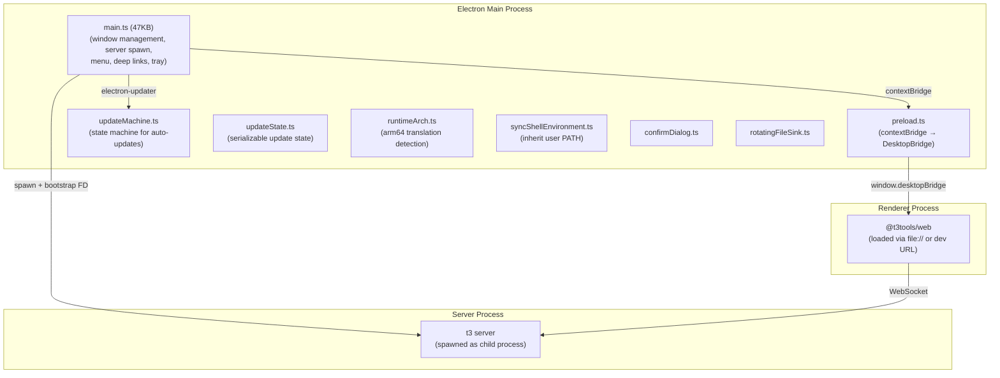

### Desktop-specific features

- **Auto-updater**: State machine (`updateMachine.ts`) manages check → download → install lifecycle
- **Bootstrap FD**: Server receives config via file descriptor 3 (avoids CLI args in process list)
- **Shell environment sync**: Inherits user's PATH from login shell for provider CLI detection
- **ARM64 translation detection**: Warns when running x64 binary under Rosetta
- **Hash history**: Uses `createHashHistory` for TanStack Router (file:// protocol compatibility)
- **Native context menus**: `DesktopBridge.showContextMenu` delegates to Electron's native menus

---

## 12. Observability

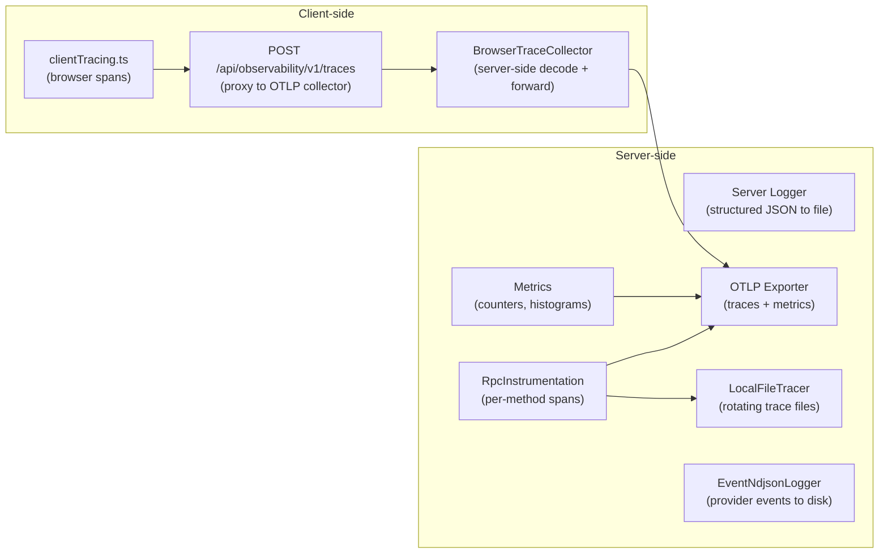

### Configuration (environment variables)

| Variable                         | Purpose                                 |
| -------------------------------- | --------------------------------------- |
| `T3CODE_TRACE_MIN_LEVEL`         | Minimum log level for local trace files |
| `T3CODE_TRACE_FILE`              | Path to trace output file               |
| `T3CODE_TRACE_MAX_BYTES`         | Max size per trace file before rotation |
| `T3CODE_TRACE_MAX_FILES`         | Max number of rotated trace files       |
| `T3CODE_OTLP_TRACES_URL`         | OTLP collector endpoint for traces      |
| `T3CODE_OTLP_METRICS_URL`        | OTLP collector endpoint for metrics     |
| `T3CODE_OTLP_EXPORT_INTERVAL_MS` | Export batch interval                   |
| `T3CODE_LOG_WS_EVENTS`           | Log outbound WebSocket push traffic     |

---

## 13. Data flow: end-to-end message lifecycle

This diagram traces a user message from keyboard input through to the AI response appearing in the chat.

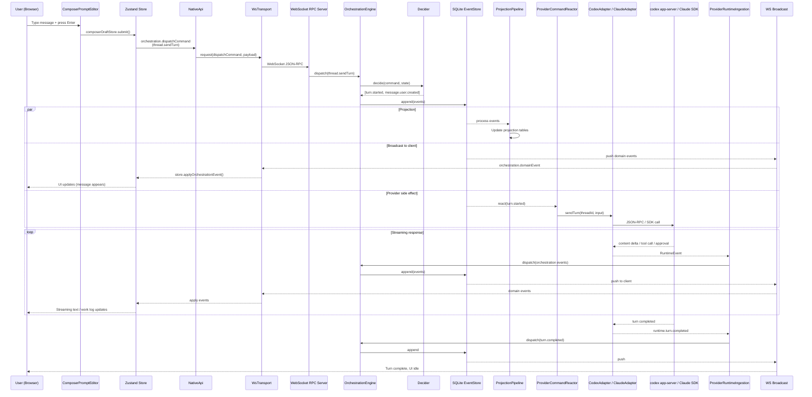

### Git integration flow

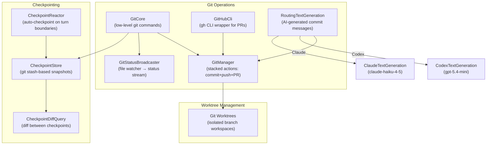

---

## Appendix: environment variables

| Variable                 | Default     | Purpose                             |
| ------------------------ | ----------- | ----------------------------------- |
| `T3CODE_PORT`            | `3773`      | HTTP/WebSocket server port          |
| `T3CODE_MODE`            | `web`       | Runtime mode (`web` or `desktop`)   |
| `T3CODE_HOME`            | `~/.t3code` | Base directory for state and config |
| `T3CODE_NO_BROWSER`      | `false`     | Disable auto-open browser on start  |
| `T3CODE_AUTH_TOKEN`      | none        | Required token for WebSocket auth   |
| `VITE_WS_URL`            | auto        | WebSocket URL override for dev      |
| `VITE_DEV_SERVER_URL`    | none        | Dev web URL for proxy/redirect      |
| `ELECTRON_RENDERER_PORT` | none        | Electron dev renderer port          |
| `T3CODE_DESKTOP_WS_URL`  | none        | Desktop WebSocket URL override      |
